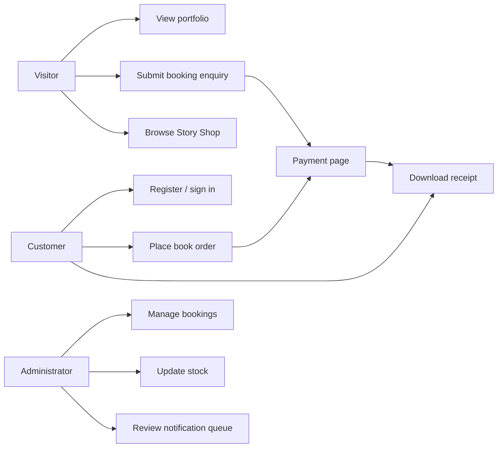
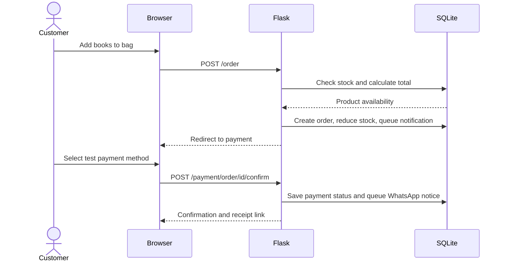
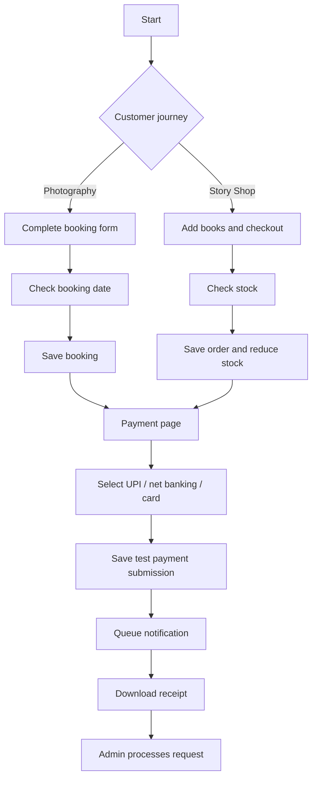
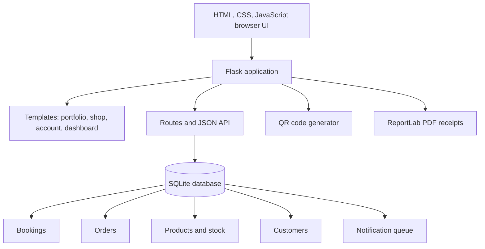
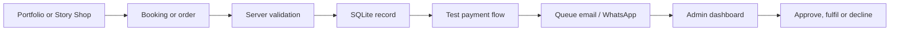

# AK CLICKS - Diagrams, Test Cases and Core Code

## Use Case Diagram



## Sequence Diagram - Book Order



## Activity / Flowchart



## System Architecture Diagram



## Workflow Chart



## Real-Time Performance Notes

| Area | Current behaviour | Measurement recommendation |
|---|---|---|
| Page load | Local Flask templates and static images are served on demand. | Browser Lighthouse; aim for LCP below 2.5 seconds after image optimisation. |
| Availability check | `GET /availability` performs one indexed-size SQLite count query. | Record response time; aim below 200 ms locally. |
| Order checkout | Server validates stock and writes order/inventory records in one transaction. | Load test concurrent purchases before production. |
| QR/receipt generation | SVG QR and PDF receipt are generated on demand. | Monitor request latency and cache only if traffic requires it. |
| Notifications | Queued locally, not sent externally. | Add delivery status, retry jobs and provider metrics after integration. |

## Test Case Table

| ID | Test case | Expected result |
|---|---|---|
| TC-01 | Submit valid booking form | Booking record is created and payment page opens. |
| TC-02 | Check unused event date | API returns `available: true`. |
| TC-03 | Create a customer account | Password hash is stored and customer session starts. |
| TC-04 | Order books with available stock | Total is recalculated; order is saved; stock decreases. |
| TC-05 | Order unavailable stock | Order is rejected and stock is unchanged. |
| TC-06 | Submit payment method | Test payment status and method are stored. |
| TC-07 | Download receipt | PDF response downloads with test-mode disclaimer. |
| TC-08 | Open admin dashboard without login | User is redirected to admin login. |
| TC-09 | Update stock as administrator | New inventory number is saved. |
| TC-10 | Trigger booking/order event | Notification queue receives a record. |

## Main Code Extracts

### Flask route - booking creation

```python
@app.route("/book", methods=["POST"])
def book():
    fields = {key: request.form.get(key, "").strip()
              for key in ("name", "email", "phone", "service",
                          "booking_date", "location", "message")}
    if not all(fields[key] for key in ("name", "email", "phone", "service", "booking_date")):
        flash("Please complete all required booking details.", "error")
        return redirect(url_for("home") + "#booking")
    with db_connection() as conn:
        cursor = conn.execute("INSERT INTO bookings (name,email,phone,service,booking_date,location,message) VALUES (:name,:email,:phone,:service,:booking_date,:location,:message)", fields)
        booking_id = cursor.lastrowid
    return redirect(url_for("payment", kind="booking", record_id=booking_id))
```

### Server-side stock validation

```python
requested = Counter(item.strip() for item in customer["items"].split(",") if item.strip())
all_products = {row["name"]: row for row in conn.execute("SELECT * FROM products")}
if any(name not in all_products or all_products[name]["stock"] < quantity for name, quantity in requested.items()):
    flash("One or more books are unavailable.", "error")
    return redirect(url_for("shop"))
for name, quantity in requested.items():
    conn.execute("UPDATE products SET stock=stock-? WHERE id=?", (quantity, all_products[name]["id"]))
```

### Availability API

```python
@app.route("/availability")
def availability():
    date = request.args.get("date", "")
    with db_connection() as conn:
        count = conn.execute("SELECT COUNT(*) FROM bookings WHERE booking_date=? AND status != 'Declined'", (date,)).fetchone()[0]
    return jsonify({"date": date, "available": count == 0})
```

### Receipt endpoint

```python
@app.route("/receipt/<kind>/<int:record_id>.pdf")
def receipt(kind, record_id):
    _, record, amount = payment_record(kind, record_id)
    data = io.BytesIO()
    pdf = canvas.Canvas(data, pagesize=A4)
    # Draw branded receipt data, then return the PDF response.
    pdf.save()
    return Response(data.getvalue(), mimetype="application/pdf")
```
